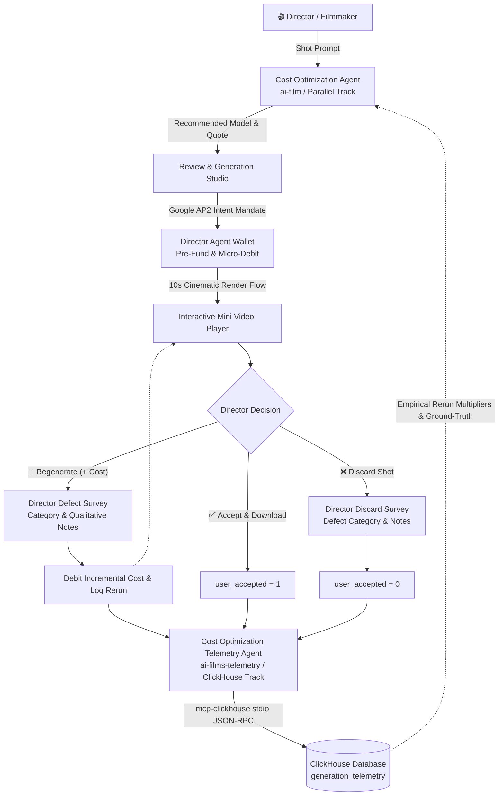

# 🎬 Cost Optimization Telemetry Agent
### Autonomous Video Generation Empirical Telemetry Daemon & Google AP2 Payment Gateway

[](https://agent-film-cost-optimizer-709949980336.us-central1.run.app)
[](https://agentic-cinema.devpost.com/rules)
[](https://github.com/google/agent-development-kit)
[](https://github.com/ClickHouse/mcp-clickhouse)
[](LICENSE)

---

> 🚀 **Live Hosted Application**: **[https://agent-film-cost-optimizer-709949980336.us-central1.run.app](https://agent-film-cost-optimizer-709949980336.us-central1.run.app)**  
> 🔗 **Sibling Repository (Parallel Track)**: **[agent-film-cost-optimizer](https://github.com/watsoncsulahack/agent-film-cost-optimizer)**  
> 🏆 **Built for**: *Agentic Cinema: The Blockbuster Hackathon* (ClickHouse MCP Track)

---

## 💡 Overview & Closed-Loop Architecture

In generative AI video production, catalog pricing quotes frequently diverge from actual realized costs due to iterative prompt adjustments, motion artifact rejections, and regeneration loops (averaging 2.2x to 4.0x per final shot).

The **Cost Optimization Telemetry Agent** provides autonomous empirical telemetry and payment governance:
1. **Tracks Empirical Ground-Truth**: Captures actual per-shot realized costs, rerun iteration counts, and director acceptance outcomes.
2. **Autonomous Agent Payments (Google AP2 Protocol)**: Enforces cryptographic intent mandates, budget caps, and micro-metered debits per video generation and rerun.
3. **Persists to ClickHouse via MCP**: Dispatches structured, non-blocking telemetry records directly to ClickHouse via the official `mcp-clickhouse` server.
4. **Feeds Historical Intelligence Back**: Aggregates empirical multipliers and acceptance rates, enabling the upstream **Cost Optimization Agent** to produce increasingly accurate recommendations over time.



---

## 🏛️ ClickHouse DDL Schema (`generation_telemetry`)

The agent automatically verifies and initializes the target table via `mcp-clickhouse`:

```sql
CREATE TABLE IF NOT EXISTS generation_telemetry (
    session_id UUID,
    prompt_text String,
    suggested_model LowCardinality(String),
    base_api_cost Float32,
    total_rerun_count Int32,
    total_session_cost Float32,
    user_accepted UInt8,
    feedback_category LowCardinality(String) DEFAULT 'unspecified',
    director_feedback String DEFAULT '',
    created_at DateTime DEFAULT now()
) ENGINE = MergeTree()
ORDER BY (suggested_model, created_at);
```

---

> ⚠️ **Demonstration & Simulation Notice**: This project models autonomous AI agent compute micro-payments (Google AP2 mandate compliance) and empirical defect telemetry for the *Agentic Cinema Blockbuster Hackathon*. All wallet balances ($10.0000), agent debits, and compute fund top-ups are **100% simulated in software**. No actual fiat money, credit cards, or live financial transactions take place.

---

## 🚀 Key Features

* **Browser-Based ClickHouse MCP Database Explorer (`/database`)**: Dedicated interactive web console to query live ClickHouse ground-truth tables, filter by defect taxonomy, inspect qualitative notes, view empirical multiplier matrices, and export JSON/CSV.
* **Director Feedback & Defect Diagnostics Survey**: Captures structured defect taxonomy (motion artifacts, physics glitches, lighting consistency, prompt deviations) and qualitative notes on every regenerate and discard action.
* **Google AP2 Mandate Engine**: Transparent director spending mandates, wallet pre-funding, and micro-payment ledger adhering to agentic payment protocols.
* **10-Second Cinematic Rendering HUD**: Real-time progress tracker and phase ticker transitioning into an embedded HTML5 mini video player.
* **Non-Destructive Session Resume**: Floating resume badge at the bottom-right corner to continue reviewing active generation sessions at any time.
* **Fault-Tolerant MCP Architecture**: Resilient local JSONL fallback with seamless automatic recovery.
* **Standalone CLI Inspector**: Inspect empirical statistics from the terminal via `python inspect_telemetry.py`.

---

## 🛠️ Quickstart & Local Setup

### 1. Clone & Install
```bash
git clone https://github.com/watsoncsulahack/agent-film-cost-optimizer-telemetry.git
cd agent-film-cost-optimizer-telemetry
pip install -r requirements.txt
```

### 2. Configure Environment
Copy `.env.example` to `.env` and set your API keys:
```bash
cp .env.example .env
```

### 3. Launch the Studio & Explorer
```bash
./run.sh
```
* **Main Studio**: [http://localhost:8000](http://localhost:8000)
* **ClickHouse MCP Explorer**: [http://localhost:8000/database](http://localhost:8000/database)

### 4. Run the Test Suite
```bash
PYTHONPATH=. pytest -v tests/
```

### 5. Inspect ClickHouse Ground-Truth Data via CLI
```bash
python inspect_telemetry.py
# Or with raw JSON records
python inspect_telemetry.py --raw
```

---

## 📄 License
Licensed under the [Apache License 2.0](LICENSE).
