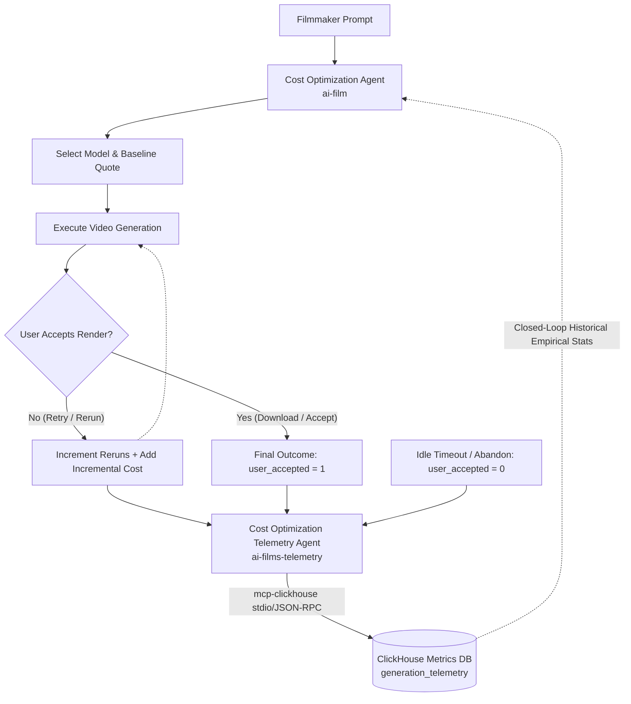

# Cost Optimization Telemetry Agent

[](https://agentic-cinema.devpost.com/rules)
[](https://github.com/google/agent-development-kit)
[](https://github.com/ClickHouse/mcp-clickhouse)
[](LICENSE)

An autonomous monitoring daemon and telemetry agent for the **Agentic Cinema** video production pipeline. Built with **Google ADK (Agent Development Kit)**, **Google Gemini**, and the official **ClickHouse Model Context Protocol (`mcp-clickhouse`)** server.

---

## 🌟 Overview & Closed-Loop Architecture

In AI video generation workflows, preliminary cost quotes from upstream models often diverge from real-world expenditure due to prompt iterations, physics failures, motion artifacts, and user regeneration loops.

The **Cost Optimization Telemetry Agent** closes this loop:
1. **Captures Ground-Truth Metrics**: Intercepts video generation sessions, tracking baseline quotes, user rejections/reruns, and cumulative realized costs.
2. **Monitors Acceptance & Timeouts**: Detects positive acceptance (downloads/approvals) vs negative terminal events (abandonment or 15-minute idle timeouts).
3. **Persists to ClickHouse via MCP**: Employs non-blocking stdio/JSON-RPC communication with the official ClickHouse MCP server (`mcp-clickhouse`) to append records to `generation_telemetry`.
4. **Feeds Empirical Intelligence Back**: Computes effective cost multipliers and empirical model acceptance rates, empowering the upstream **Cost Optimization Agent** (`ai-film`) to make increasingly accurate, data-driven model recommendations over time.



---

## 📊 ClickHouse Telemetry Schema

The agent ensures the target ClickHouse table exists via DDL on startup:

```sql
CREATE TABLE IF NOT EXISTS generation_telemetry (
    session_id UUID,
    prompt_text String,
    suggested_model LowCardinality(String),
    base_api_cost Float32,
    total_rerun_count Int32,
    total_session_cost Float32,
    user_accepted UInt8,
    created_at DateTime DEFAULT now()
) ENGINE = MergeTree()
ORDER BY (suggested_model, created_at);
```

### Field Specifications
| Attribute | Type | Nullable | Source | Description |
| :--- | :--- | :--- | :--- | :--- |
| `session_id` | `UUID` | No | System Orchestrator | Unique identifier for generation session. |
| `prompt_text` | `String` | No | Ingestion Agent | Raw text prompt used for the generation run. |
| `suggested_model` | `LowCardinality(String)` | No | User Selection | Video model executed (e.g., Runway Gen-3, Luma Ray 2, Sora, Kling). |
| `base_api_cost` | `Float32` | No | Pricing Script | Estimated baseline cost for a single generation run. |
| `total_rerun_count` | `Int32` | No | Telemetry Agent | Total number of regeneration retries attempted. |
| `total_session_cost` | `Float32` | No | Telemetry Agent | Cumulative API cost incurred across all retries. |
| `user_accepted` | `UInt8` | No | User Feedback | Binary flag: `1` if video accepted, `0` if rejected/abandoned. |
| `created_at` | `DateTime` | No | System Clock | UTC timestamp at moment of record commit. |

---

## 🚀 Quick Start

### 1. Installation

```bash
# Clone the repository
git clone https://github.com/your-username/ai-films-telemetry.git
cd ai-films-telemetry

# Install in editable mode
pip install -e .
```

### 2. Environment Setup

Copy `.env.example` to `.env` and configure your credentials:

```bash
cp .env.example .env
```

```env
# Google Gemini API Key
GEMINI_API_KEY=your_gemini_api_key

# ClickHouse Configuration
CLICKHOUSE_HOST=localhost
CLICKHOUSE_PORT=8443
CLICKHOUSE_USER=default
CLICKHOUSE_PASSWORD=
CLICKHOUSE_DATABASE=default

# Official ClickHouse MCP Server Command
MCP_CLICKHOUSE_COMMAND=uvx mcp-clickhouse
IDLE_TIMEOUT_SECONDS=900
```

### 3. Run the Automated Showcase Demo

```bash
python main.py --demo
```

### 4. Run the Google ADK Interactive Agent

```bash
python main.py --query "Show me the empirical performance breakdown and effective cost multipliers for all video generation models"
```

---

## 🌐 Unified Web App & Upstream Integration

Both `ai-film` (Cost Optimization Agent) and `ai-films-telemetry` (Telemetry Agent) are unified within the Google Cloud hosted web application.

### Python SDK Integration

```python
from telemetry_agent import TelemetryClient

client = TelemetryClient()

# 1. Initialize session when user submits prompt
session_id = client.start_session(
    prompt_text="Drone shot over futuristic metropolis at sunset",
    suggested_model="Runway Gen-3 Alpha",
    base_api_cost=0.0500,
)

# 2. Record rerun when user requests regeneration
client.record_rerun(
    session_id=session_id,
    incremental_cost=0.0500,
    reason="Adjust camera angle",
)

# 3. Finalize upon acceptance (writes to ClickHouse via MCP)
client.complete_session(session_id=session_id, accepted=True)

# 4. Query empirical stats to improve cost optimization recommendations
model_insights = client.get_model_insights("Runway Gen-3 Alpha")
```

### FastAPI Bridge

Mount the telemetry router into any existing FastAPI web application:

```python
from fastapi import FastAPI
from telemetry_agent import telemetry_router

app = FastAPI()
app.include_router(telemetry_router)
```

---

## 🧪 Testing

Run the full test suite covering session lifecycles, precision enforcement, idle timeout watchdogs, and MCP fault tolerance:

```bash
pytest tests/ -v
```

---

## 📜 License

Licensed under the [Apache License, Version 2.0](LICENSE).
